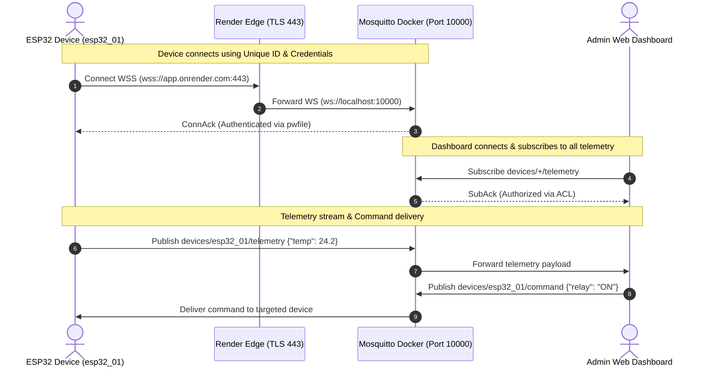

# render-mqtt-broker-multi-device

> **Multi‑device MQTT broker over WebSocket for Render – ESP32 / IoT ready, unique client IDs, per‑device topics, optional auth.**

[](https://render.com)
[](#)
[-660066?logo=mqtt&logoColor=white)](#)
[](LICENSE)

---

## 📖 Table of Contents
1. [Overview](#-overview)
2. [Why WebSocket on Render?](#-why-websocket-on-render)
3. [Key Features](#-key-features)
4. [High-Level Architecture](#-high-level-architecture)
   - [ASCII System Diagram](#ascii-system-diagram)
   - [Mermaid Sequence Flow](#mermaid-sequence-flow)
5. [Repository Structure](#-repository-structure)
6. [Topic Namespace & ACL Design](#-topic-namespace--acl-design)
7. [Deploying to Render (Step-by-Step)](#-deploying-to-render-step-by-step)
   - [Method A: Cloud Environment Variables (Recommended)](#method-a-cloud-environment-variables-recommended)
   - [Method B: Private Password File (pwfile)](#method-b-private-password-file-pwfile)
8. [Device Configuration Guide](#-device-configuration-guide)
   - [1. Unique Device Identification](#1-unique-device-identification)
   - [2. Connection Parameters](#2-connection-parameters)
   - [3. ESP32 / ESP8266 Arduino Example](#3-esp32--esp8266-arduino-example)
   - [4. Python / Gateway Example](#4-python--gateway-example)
   - [5. Web Dashboard (JavaScript / Browser)](#5-web-dashboard-javascript--browser)
9. [Local Testing & Development](#-local-testing--development)
10. [Security Hardening Recommendations](#-security-hardening-recommendations)
11. [License](#-license)

---

## 🌟 Overview

`render-mqtt-broker-multi-device` provides a production-ready, containerized Eclipse Mosquitto MQTT broker tailored specifically for deployment on **Render Web Services**.

Traditional MQTT brokers listen on raw TCP port 1883 or 8883 (MQTTS). However, cloud PaaS providers like Render only expose a single HTTP/WebSocket port per web service. This repository configures Mosquitto to operate exclusively over **WebSockets (ws / wss)** on that single port. Render automatically provides **free, managed SSL/TLS termination**, giving your IoT fleet end-to-end encrypted **WSS** connections out of the box with zero certificate management hassle.

---

## 💡 Can this connect `mqtt://` and `mqtts://`?

### The Short Answer
* **On Render (Public Internet):** You connect using **`ws://`** and **`wss://`** (WebSocket). 
  * `wss://` is the exact secure equivalent of `mqtts://`. It gives you full **TLS encryption** and authentication, running over standard HTTPS/WebSocket port 443 with Render's free auto-renewing SSL certificate.
  * Render's public cloud router **only routes HTTP/WebSocket traffic**; it does not forward raw TCP ports (1883 / 8883) to public internet web services.
* **Locally (Docker Compose) or on a VPS:** **YES!** Both standard raw TCP **`mqtt://` (Port 1883)** and **`ws://` (Port 10000)** are active simultaneously!
* **Inside Render Private Networks:** If you run other microservices on Render that connect privately to the broker, they **can** use raw TCP `mqtt://<service-name>:1883`.

### Protocol & Port Comparison Matrix

| Protocol URI | Underlying Transport | Port | Supported on Render Public? | Supported Locally / VPS? | TLS Encrypted? |
| :--- | :--- | :--- | :--- | :--- | :--- |
| **`mqtt://`** | Raw TCP | `1883` | ❌ *(Render blocks raw TCP)* |  *(Active by default)* | ❌ Plaintext |
| **`mqtts://`** | Raw TCP + TLS | `8883` | ❌ *(Render blocks raw TCP)* |  *(Via `ssl/` certs)* |  Encrypted |
| **`ws://`** | HTTP WebSocket | `10000` |  *(Development)* |  *(Active by default)* | ❌ Plaintext |
| **`wss://`** | HTTPS WebSocket + TLS | `443` |  **(Recommended for Render)** |  *(With reverse proxy)* |  **Render Free SSL** |

---

## 🚀 Key Features

* **Multi-Device Ready**: Designed to scale from a single test board to thousands of field devices (ESP32, ESP8266, Raspberry Pi, Arduino, mobile apps).
* **Strict Per-Device Topic Isolation**: Employs Mosquitto ACL patterns (`%u`) so that devices can only publish to their designated telemetry topic and listen to their specific command queue.
* **Granular Authentication**: Rejects unauthenticated/anonymous access. Every device must supply a valid username and password.
* **Free Managed TLS (WSS)**: Connect securely over `wss://<your-service>.onrender.com:443` without maintaining local certificates.
* **Zero-Crash Auto-Configuration**: Smart Docker entrypoint automatically configures ports from Render's `$PORT` and can dynamically generate device credentials from Render environment variables.
* **Instant Verification Dashboard**: Includes a bundled browser test client (`test-client.html`) for real-time monitoring and command publishing.

---

## 🏗 High-Level Architecture

### ASCII System Diagram

```text
 +-----------------------------------------------------------------------------------+
 |                                   RENDER CLOUD                                    |
 |                                                                                   |
 |                     Public Internet Endpoint: wss://your-broker.onrender.com:443  |
 |                                                      |                            |
 |                                      (Automatic TLS Termination)                  |
 |                                                      v                            |
 |  +-----------------------------------------------------------------------------+  |
 |  | Docker Web Service (Container Port: 10000)                                  |  |
 |  |                                                                             |  |
 |  |   +----------------------------------------------------------------------+  |  |
 |  |   | Eclipse Mosquitto Broker (Protocol: WebSockets)                     |  |  |
 |  |   |                                                                      |  |  |
 |  |   |  - Authentication: /mosquitto/config/pwfile                          |  |  |
 |  |   |  - Access Control:  /mosquitto/config/aclfile (Pattern: %u)          |  |  |
 |  |   +----------------------------------------------------------------------+  |  |
 |  +-----------------------------------------------------------------------------+  |
 +-----------------------------------------------------------------------------------+
                  ^                                              ^
                  |                                              |
      (WSS: Port 443 / MQTT)                        (WSS: Port 443 / MQTT)
                  |                                              |
    +-------------+-------------+                  +-------------+-------------+
    |                           |                  |                           |
    v                           v                  v                           v
+------------------+    +------------------+    +------------------+    +------------------+
|   ESP32 Node 1   |    |   ESP32 Node 2   |    |  Admin Dashboard |    | Backend Service  |
|  ID: esp32_01    |    |  ID: esp32_02    |    |  ID: admin       |    |  ID: backend     |
|                  |    |                  |    |                  |    |                  |
| Pub:             |    | Pub:             |    | Sub:             |    | Sub:             |
| devices/esp32_01 |    | devices/esp32_02 |    | devices/+/telemetry|  | devices/+/telemetry|
| /telemetry       |    | /telemetry       |    |                  |    | Pub:             |
| Sub:             |    | Sub:             |    | Pub:             |    | devices/<id>/    |
| devices/esp32_01 |    | devices/esp32_02 |    | devices/<id>/    |    | command          |
| /command         |    | /command         |    | command          |    |                  |
+------------------+    +------------------+    +------------------+    +------------------+
```

### Mermaid Sequence Flow



---

## 📁 Repository Structure

```text
render-mqtt-broker-multi-device/
│
├── .gitignore                    # Prevents leaking credentials, certs, and logs
├── Dockerfile                    # Container definition for Render deployment
├── docker-compose.yml            # 1-command local development setup
├── docker-entrypoint.sh          # Boots container, binds $PORT, configures users
├── mosquitto.conf                # Main broker config (WebSocket, auth, logging)
├── aclfile                       # Topic authorization enforcing %u device isolation
├── pwfile.example                # Example hashed credentials file
├── test-client.html              # Sleek browser test dashboard (WebSocket MQTT)
│
├── examples/
│   ├── esp32_websocket_client.ino # ESP32 Arduino sketch using native esp-mqtt WSS
│   └── python_device_simulator.py# Python IoT device simulator using paho-mqtt
│
└── ssl/
    └── .gitkeep                  # Reserved for optional custom TLS certificates
```

---

## 🔒 Topic Namespace & ACL Design

Each device is isolated within its own topic namespace using Mosquitto's `%u` placeholder. The `%u` pattern automatically substitutes the client's authenticated **username** (which should match the **Device ID**).

### Topic Convention

| Topic Pattern | Permission | Purpose |
| :--- | :--- | :--- |
| `devices/%u/telemetry` | **Write Only** (Device) | Device publishes sensor data, battery status, telemetry |
| `devices/%u/status` | **Write Only** (Device) | Device publishes lifecycle state (online / offline / LWT) |
| `devices/%u/command` | **Read Only** (Device) | Device listens for incoming control commands |
| `devices/+/telemetry` | **Read Only** (Dashboard/Admin) | Dashboard monitors telemetry across **all** devices |
| `devices/+/command` | **Write Only** (Dashboard/Admin) | Dashboard dispatches commands to **any** device |
| `devices/#` | **Read/Write** (Admin) | Full management access for administrative backends |

> **Security Note:** If `esp32_01` attempts to publish to `devices/esp32_02/telemetry` or subscribe to `devices/esp32_02/command`, the broker's ACL engine silently drops or rejects the operation.

---

## 🚀 Deploying to Render (Step-by-Step)

### Method A: Cloud Environment Variables (Recommended)
This approach avoids committing credentials into Git. The broker's entrypoint script dynamically parses environment variables defined in the Render Dashboard.

1. **Push this repository to GitHub**:
   ```bash
   git init
   git add .
   git commit -m "feat: initial render mqtt broker setup"
   git branch -M main
   git remote add origin https://github.com/<your-username>/render-mqtt-broker-multi-device.git
   git push -u origin main
   ```

2. **Create a Web Service on Render**:
   - Log in to your [Render Dashboard](https://dashboard.render.com).
   - Click **New +** > **Web Service**.
   - Select your GitHub repository.
   - Choose **Docker** as the Environment.
   - Pick your preferred Region and Instance Type (the Free or Starter tier works great).

3. **Configure Environment Variables in Render**:
   Under the **Environment** tab of your service, add:
   - `PORT`: `10000` *(Render sets this automatically)*
   - `MQTT_DEVICES`: A comma-separated list of `device_id:password` pairs.
     ```text
     admin:SuperSecretAdminPass123,esp32_01:SensorPass456,sensor_kitchen:KitchenPass789
     ```

4. **Click Deploy**:
   Render builds the Docker image and starts the container. Your broker will be live at:
   ```text
   wss://<your-service-name>.onrender.com:443
   ```

---

### Method B: Private Password File (`pwfile`)
If you manage credentials via pre-hashed password files:

1. Generate a hashed password file using Mosquitto's CLI utility:
   ```bash
   # Create a new file with the first user
   docker run --rm -it -v ${PWD}:/work -w /work eclipse-mosquitto:latest \
     mosquitto_passwd -c -b pwfile admin MyAdminPassword123

   # Add additional devices
   docker run --rm -it -v ${PWD}:/work -w /work eclipse-mosquitto:latest \
     mosquitto_passwd -b pwfile esp32_01 DevicePass456
   ```

2. Ensure your repository is **Private** before committing the `pwfile`, or use Render Secret Files to mount it at `/mosquitto/config/pwfile`.

---

## 📱 Device Configuration Guide

### 1. Unique Device Identification
Every physical device must have a globally unique identifier. Recommended strategies:
* **MAC Address**: `esp32_240AC459B01A` (guaranteed unique per chip)
* **Serial Number**: `device_SN_987214`
* **Custom Name**: `living_room_temp_01`

### 2. Connection Parameters

| Parameter | Local Testing Value | Render Production Value |
| :--- | :--- | :--- |
| **Host / URL** | `192.168.1.xxx` or `localhost` | `your-service.onrender.com` |
| **Port** | `10000` | `443` |
| **Transport Protocol** | `ws` (Plain WebSocket) | `wss` (Secure WebSocket with TLS) |
| **Client ID** | Unique Device ID | Unique Device ID |
| **Username** | Unique Device ID | Unique Device ID |
| **Password** | Device password | Device password |
| **Path** | `/` or `/mqtt` | `/` or `/mqtt` |

---

### 3. ESP32 / ESP8266 Arduino Example
The ESP32 Arduino framework includes native support for MQTT over Secure WebSockets via `esp-mqtt`. A complete, production-ready sketch is included in [examples/esp32_websocket_client.ino](examples/esp32_websocket_client.ino).

**Core snippet:**
```cpp
#include <WiFi.h>
#include "mqtt_client.h"

const char* BROKER_URI = "wss://your-app-name.onrender.com:443";
const char* DEVICE_ID  = "esp32_01";
const char* PASSWORD   = "SensorPass456";

void initMQTT() {
    esp_mqtt_client_config_t mqtt_cfg = {};
    mqtt_cfg.uri = BROKER_URI;
    mqtt_cfg.client_id = DEVICE_ID;
    mqtt_cfg.username  = DEVICE_ID;
    mqtt_cfg.password  = PASSWORD;
    mqtt_cfg.transport = MQTT_TRANSPORT_OVER_WSS;

    esp_mqtt_client_handle_t client = esp_mqtt_client_init(&mqtt_cfg);
    esp_mqtt_client_start(client);
}
```

---

### 4. Python / Gateway Example
For Raspberry Pi, Linux gateways, or PC simulators, use Python's `paho-mqtt` library. A complete script is provided in [examples/python_device_simulator.py](examples/python_device_simulator.py).

```bash
pip install paho-mqtt
python examples/python_device_simulator.py \
  --host your-service.onrender.com \
  --port 443 \
  --protocol wss \
  --device-id esp32_01 \
  --username esp32_01 \
  --password SensorPass456
```

---

### 5. Web Dashboard (JavaScript / Browser)
Web applications can connect directly without any proxy using [MQTT.js](https://github.com/mqttjs/MQTT.js):

```javascript
import mqtt from 'mqtt';

const client = mqtt.connect('wss://your-service.onrender.com:443', {
  clientId: 'dashboard_' + Math.random().toString(16).substr(2, 8),
  username: 'admin',
  password: 'SuperSecretAdminPass123',
  clean: true
});

client.on('connect', () => {
  console.log('Connected to broker!');
  // Subscribe to telemetry across all devices
  client.subscribe('devices/+/telemetry');
});

client.on('message', (topic, message) => {
  const data = JSON.parse(message.toString());
  console.log(`Received from ${topic}:`, data);
});
```

---

## 🧪 Local Testing & Development

### 1. Launch with Docker Compose
Run the broker locally with one command:
```bash
docker compose up --build
```
The broker starts listening on `ws://localhost:10000`.

### 2. Verify with the Built-in Test Dashboard
1. Open [test-client.html](test-client.html) directly in any modern web browser.
2. Settings:
   - **Host**: `localhost`
   - **Port**: `10000`
   - **Protocol**: `ws`
   - **Username**: `admin`
   - **Password**: `admin123`
3. Click **Connect**.
4. Click **Start Auto-Publish** to simulate telemetry or send targeted commands to devices.

---

## 🛡 Security Hardening Recommendations

1. **Keep Secrets Out of Public Repositories**:
   Never commit plain-text credentials or production `pwfile` entries to public Git branches. Use Render's Environment Variables (`MQTT_DEVICES`) or Secret Files.
2. **Enforce WSS in Production**:
   Always connect via `wss://` on port 443. Render encrypts the channel using modern TLS cipher suites.
3. **Use Robust Password Entropy**:
   Generate 16+ character random passwords for each device using a password generator or cryptographic token.
4. **Last Will and Testament (LWT)**:
   Configure devices to register an LWT message on `devices/<deviceId>/status` with payload `{"status": "offline"}` so that network dropouts are immediately detected by your dashboard.
5. **Monitor Connection Logs**:
   Mosquitto is configured to stream connection and subscription events to standard output, visible in real time on the Render logs tab.

---

## 📄 License

This project is licensed under the [MIT License](LICENSE). You are free to use, modify, and distribute it in personal and commercial IoT projects.
